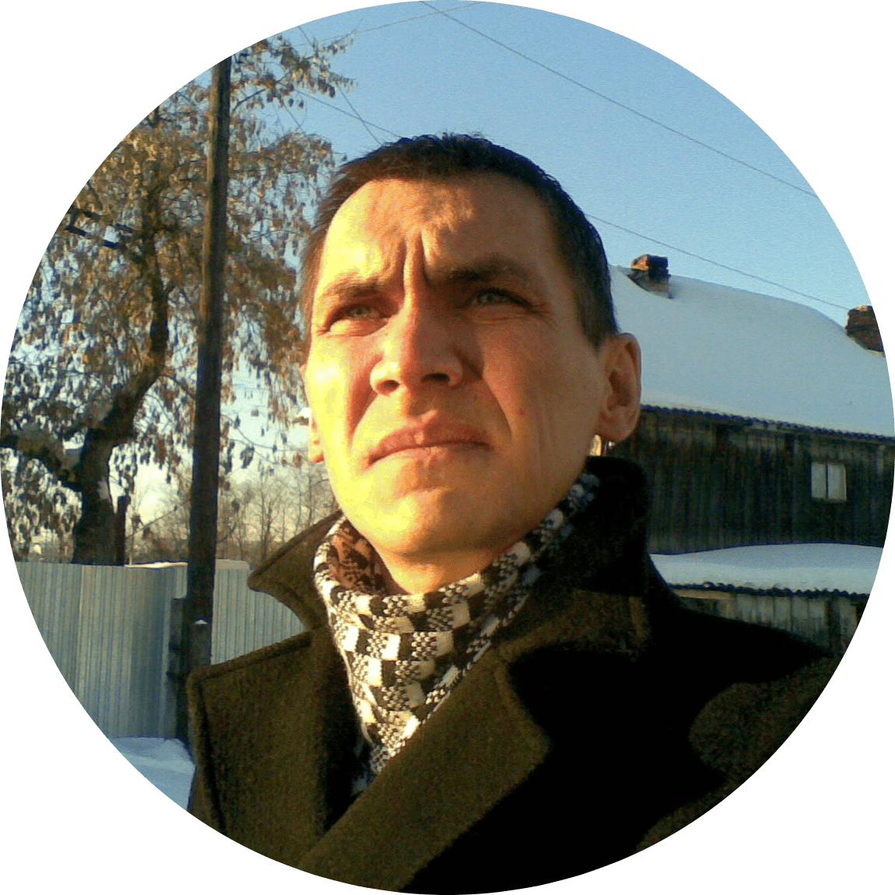

## Maxim Krestyaninov

## Contacts

> Location: Russia, Izhevsk

> Phone: +79124407342

> Email: m.krestyaninov@gmail.com

> Discord: [Maxim Krestyaninov](https://discordapp.com/users/956476292491014165/)

> You can also contact me by [Telegram](https://t.me/maxim_vladimirovich).

## About Me

I am currently taking courses on frontend development at RS-School. In the future, I want to start my career as a developer on a more serious level. I am learning new things quickly, persevering, not conflicted.

## Skills

+ HTML
+ CSS
+ JavaScript
+ Figma
+ Git

## Code Examples

[CODEWARS](https://www.codewars.com/kata/52597aa56021e91c93000cb0): Write an algorithm that takes an array and moves all of the zeros to the end, preserving the order of the other elements.
```
var moveZeros = function (arr) {
  return arr.filter(item => item !== 0).concat(arr.filter(item => item === 0));
}
```

[My GitHub](https://github.com/maxipy18)